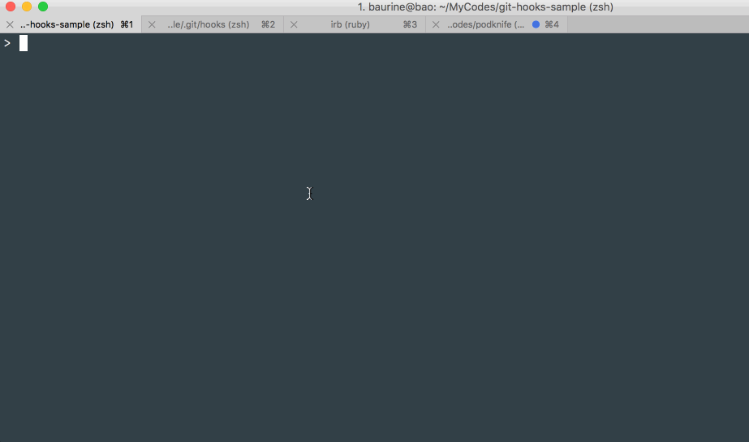
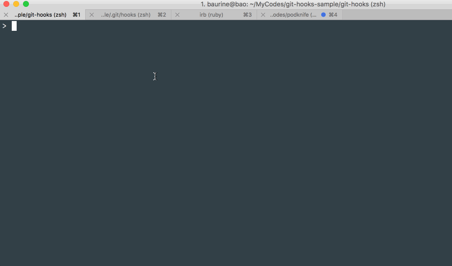

# Git Hooks Sample

Sample for git hooks: `pre-commit`, `prepare-commit-msg`, `commit-msg`, written by ruby.

## References

1. [Git钩子：自定义你的工作流](https://github.com/geeeeeeeeek/git-recipes/wiki/5.4-Git%E9%92%A9%E5%AD%90%EF%BC%9A%E8%87%AA%E5%AE%9A%E4%B9%89%E4%BD%A0%E7%9A%84%E5%B7%A5%E4%BD%9C%E6%B5%81)

## How to run

Copy `git-hooks/*` to your git repo `.git/hooks` folder, add execute permission for them by `chmod u+x`.

Then if you commit code in a branch its name follows `feature|bug|hotfix|misc|refactro/issue-num_content` format, it will automatically pre-fill your commit message, for example, if the branch name is `misc/123_fix_typo`, it will automatically pre-fill your commit message by `MISC #123 - Fix typo`.

Pre-filling commit message only works in command console, doesn't work in tools with UI, likes SourceTree, GitUp.

And your commit message must follow the required format: `FEATURE|BUG|MISC|REFACOTR #num - Content`, else the commit will be rejected.

You can modified the hooks according to your need.

## Demo

1. Pre commit hook, check code style:

   

1. Prepare commit message hook, pre-fill some commit message:

   

1. Commit message hook, check commit message format:

   
